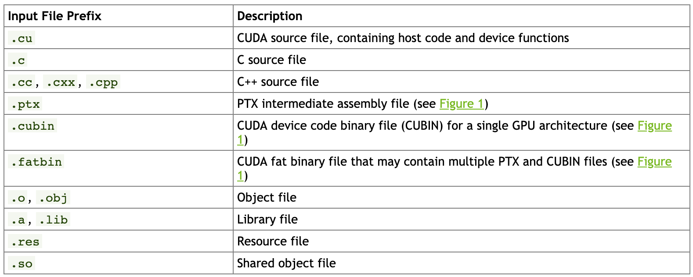

# CUDA compiler nvcc

See [CUDA compiler driver nvcc](https://docs.nvidia.com/cuda/cuda-compiler-driver-nvcc/index.html) for reference!

[Nvidia CUDA Compiler (NVCC)](https://en.wikipedia.org/wiki/NVIDIA_CUDA_Compiler) is a proprietary compiler by Nvidia intended for use with CUDA. CUDA code runs on both the CPU and GPU. NVCC separates these two parts and sends host code (the part of code which will be run on the CPU) to a C compiler like GCC or Intel C++ Compiler (ICC) or Microsoft Visual C Compiler, and sends the device code (the part which will run on the GPU) to the GPU. The device code is further compiled by NVCC. NVCC is based on LLVM. According to Nvidia provided documentation, nvcc in version 7.0 supports many language constructs that are defined by the C++11 standard and a few C99 features as well. In version 9.0 several more constructs from the C++14 standard are supported.

## Installation

* [Linux](https://docs.nvidia.com/cuda/cuda-installation-guide-linux/index.html)
* [Windows](https://docs.nvidia.com/cuda/cuda-installation-guide-microsoft-windows/index.html)

## Command options

See [nvcc command options](https://docs.nvidia.com/cuda/cuda-compiler-driver-nvcc/index.html#nvcc-command-options) for reference.

## Input file prefix

## CUDA Compilation trajectory

* The input program is preprocessed for device compilation compilation and is compiled to CUDA binary (cubin) and/or PTX intermediate code.
* The input program is preprocessed once again for host compilation and is synthesized to embed the fatbinary and transform CUDA specific C++ extensions into standard C++ constructs. Then the C++ host compiler compiles the synthesized host code with the embedded fatbinary into a host object. 
* The embedded fatbinary is inspected by the CUDA runtime system whenever the device code is launched by the host program to obtain an appropriate fatbinary image for the current GPU.

